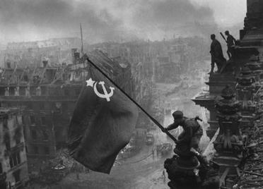

# Europe <!-- omit in toc -->
Archive repository for Europe. Pictures and videos are welcome!

## Contents

- [Massacre](#massacre)
  - [Le Paradis Massacre, 97](#le-paradis-massacre-97)
- [Concentration Camps](#concentration-camps)
  - [Auschwitz](#auschwitz)
- [Victory](#victory)

# Massacre
## Le Paradis Massacre, 97

**27 May 1940, Le Paradis village, commune of Lestrem, Northern France**

Soldiers of the 14th Company, S.S. Division Totenkopf, under the command of Hauptsturmführer Fritz Knöchlein shot prisoners-of-war during the Battle of France.

# Concentration Camps

## Auschwitz

The Auschwitz concentration camp (German: Konzentrationslager Auschwitz, Polish: Obóz koncentracyjny Auschwitz) was a complex of over 40 concentration and extermination camps operated by Nazi Germany in occupied Poland during World War II and the Holocaust. It consisted of Auschwitz I, the main camp (Stammlager) in Oświęcim; Auschwitz II-Birkenau, a concentration and extermination camp built with several gas chambers; Auschwitz III-Monowitz, a labor camp created to staff a factory for the chemical conglomerate IG Farben; and dozens of subcamps. The camps became a major site of the Nazis' Final Solution to the Jewish Question.

# Victory

Raising a Flag over the Reichstag (Russian: Знамя Победы над рейхстагом, tr. Znamya Pobedy nad Reykhstagom) is an iconic World War II photograph, taken during the Battle of Berlin on 2 May 1945. The photograph was reprinted in thousands of publications and came to be regarded around the world as one of the most significant and recognizable images of World War II. Owing to the secrecy of Soviet media, the identities of the men in the picture were often disputed, as was that of the photographer, Yevgeny Khaldei. It became a symbol of the Soviet victory over Nazi Germany.

<!--# Acknowledgements-->
